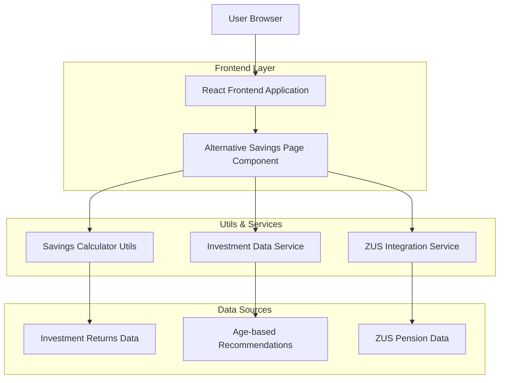
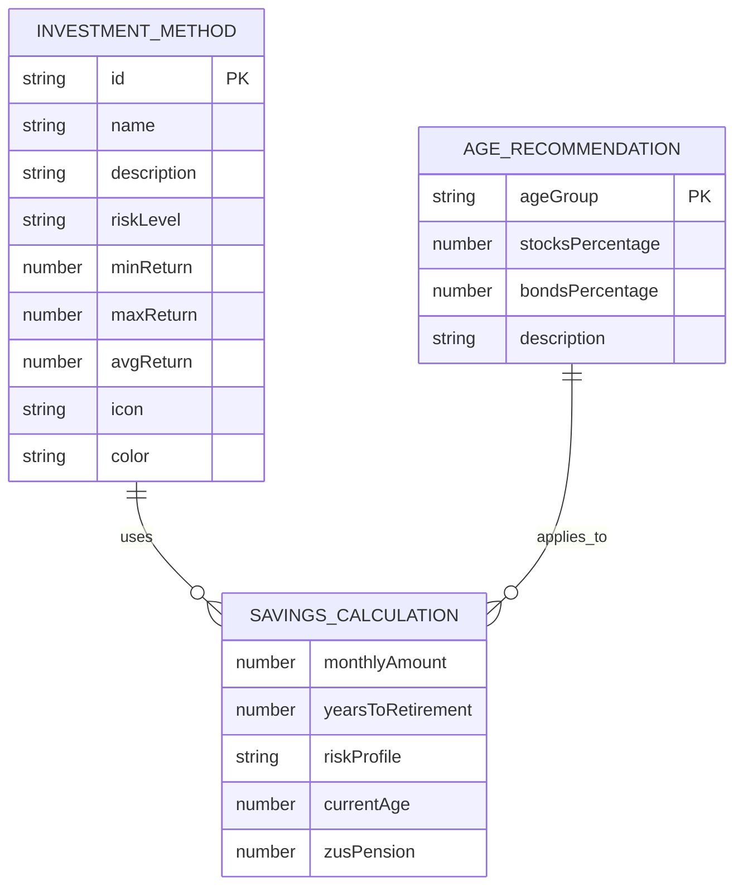

# Architektura Techniczna - Alternatywne Oszczędzanie na Emeryturę

## 1. Architecture design



## 2. Technology Description

- Frontend: React@18 + TypeScript + Tailwind CSS + Vite
- Charts: Chart.js + react-chartjs-2
- Animations: Framer Motion
- Icons: Lucide React
- State Management: React useState/useContext
- Utils: Custom calculation utilities

## 3. Route definitions

| Route | Purpose |
|-------|---------|
| /alternatywne-oszczedzanie | Główna podstrona z kalkulatorem i porównaniem metod oszczędzania |

## 4. API definitions

Podstrona wykorzystuje istniejące dane z aplikacji ZUS na Plus - nie wymaga dodatkowych API.

### 4.1 Core Data Structures

**Investment Method Interface**
```typescript
interface InvestmentMethod {
  id: string;
  name: string;
  description: string;
  riskLevel: 'low' | 'medium' | 'high';
  expectedReturn: {
    min: number;
    max: number;
    average: number;
  };
  icon: string;
  color: string;
}
```

**Savings Calculator Input**
```typescript
interface SavingsCalculatorInput {
  monthlyAmount: number;
  yearsToRetirement: number;
  riskProfile: 'conservative' | 'balanced' | 'aggressive';
  currentAge: number;
  zusPension: number;
}
```

**Calculation Result**
```typescript
interface SavingsResult {
  method: InvestmentMethod;
  totalSavings: number;
  monthlyPensionIncrease: number;
  totalPension: number;
  realValue: number;
}
```

## 5. Data model

### 5.1 Data model definition



### 5.2 Data Definition Language

**Investment Methods Data (Static)**
```typescript
const INVESTMENT_METHODS: InvestmentMethod[] = [
  {
    id: 'deposits',
    name: 'Lokaty terminowe',
    description: 'Bezpieczne lokaty bankowe',
    riskLevel: 'low',
    expectedReturn: { min: 1, max: 3, average: 2 },
    icon: 'PiggyBank',
    color: '#10B981'
  },
  {
    id: 'bonds',
    name: 'Obligacje skarbowe',
    description: 'Stabilne obligacje państwowe',
    riskLevel: 'low',
    expectedReturn: { min: 2, max: 4, average: 3 },
    icon: 'Shield',
    color: '#059669'
  },
  {
    id: 'funds',
    name: 'Fundusze inwestycyjne',
    description: 'Zdywersyfikowane portfele',
    riskLevel: 'medium',
    expectedReturn: { min: 4, max: 8, average: 6 },
    icon: 'BarChart3',
    color: '#0EA5E9'
  },
  {
    id: 'etf',
    name: 'ETF',
    description: 'Fundusze indeksowe',
    riskLevel: 'medium',
    expectedReturn: { min: 5, max: 9, average: 7 },
    icon: 'TrendingUp',
    color: '#3B82F6'
  },
  {
    id: 'stocks',
    name: 'Akcje',
    description: 'Inwestycje w spółki',
    riskLevel: 'high',
    expectedReturn: { min: 6, max: 12, average: 9 },
    icon: 'Activity',
    color: '#8B5CF6'
  },
  {
    id: 'realestate',
    name: 'Nieruchomości',
    description: 'Inwestycje w nieruchomości',
    riskLevel: 'high',
    expectedReturn: { min: 7, max: 10, average: 8 },
    icon: 'Home',
    color: '#F59E0B'
  }
];
```

**Age-based Recommendations Data**
```typescript
const AGE_RECOMMENDATIONS = [
  {
    ageGroup: '20-35',
    stocksPercentage: 70,
    bondsPercentage: 30,
    description: 'Agresywna strategia z wysokim udziałem akcji'
  },
  {
    ageGroup: '35-50',
    stocksPercentage: 50,
    bondsPercentage: 50,
    description: 'Zrównoważona strategia z równym udziałem akcji i obligacji'
  },
  {
    ageGroup: '50-65',
    stocksPercentage: 30,
    bondsPercentage: 70,
    description: 'Konserwatywna strategia z przewagą obligacji'
  }
];
```

**Risk Profiles Configuration**
```typescript
const RISK_PROFILES = {
  conservative: {
    name: 'Bezpieczny',
    description: 'Niskie ryzyko, stabilne zwroty',
    methods: ['deposits', 'bonds'],
    color: '#10B981'
  },
  balanced: {
    name: 'Zrównoważony',
    description: 'Średnie ryzyko, umiarkowane zwroty',
    methods: ['funds', 'etf'],
    color: '#3B82F6'
  },
  aggressive: {
    name: 'Agresywny',
    description: 'Wysokie ryzyko, potencjalnie wysokie zwroty',
    methods: ['stocks', 'realestate'],
    color: '#8B5CF6'
  }
};
```