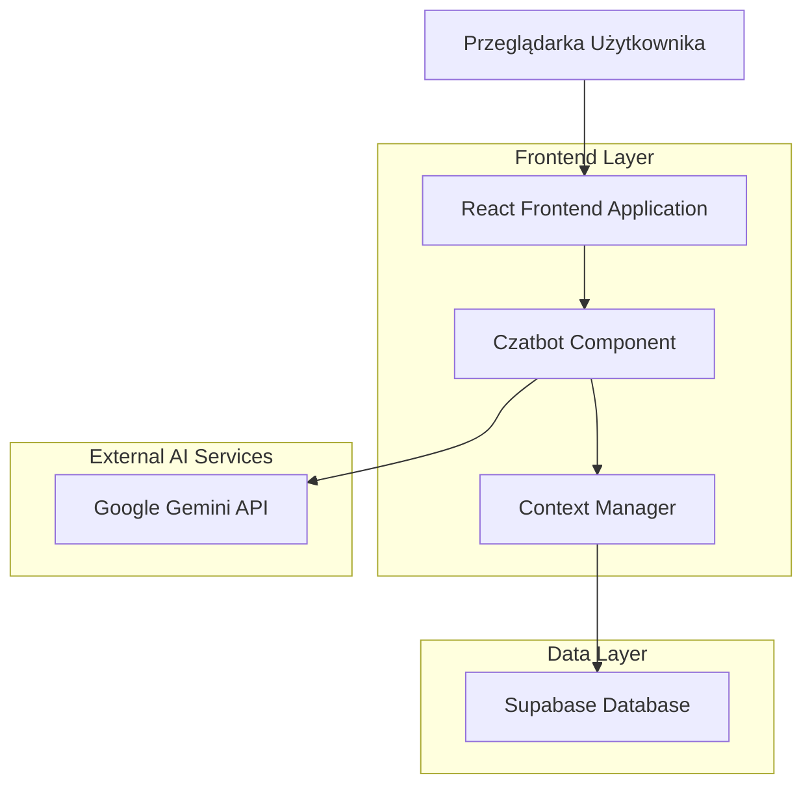
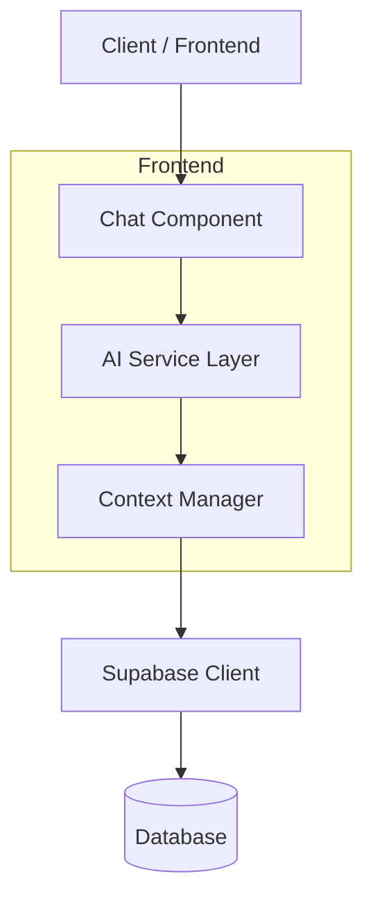
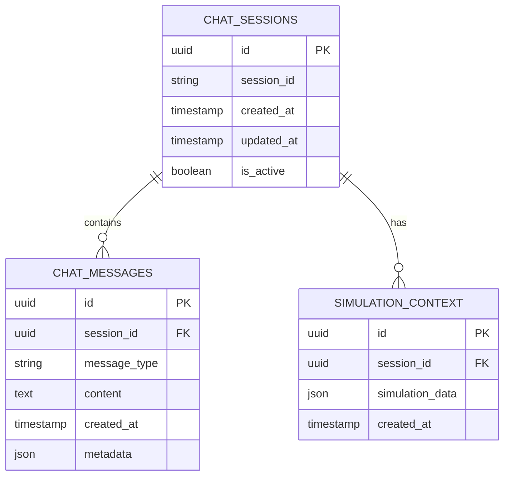

# Dokument Architektury Technicznej - Czatbot AI ZUS na Plus

## 1. Projekt Architektury



## 2. Opis Technologii

* **Frontend**: React\@18 + TypeScript + Tailwind CSS + Vite

* **AI Integration**: Google Generative AI SDK (@google/generative-ai)

* **Database**: Supabase (PostgreSQL) - dla historii czatu i kontekstu

* **State Management**: React useState/useContext

* **Icons**: Lucide React

## 3. Definicje Tras

| Trasa                      | Cel                                                        |
| -------------------------- | ---------------------------------------------------------- |
| Wszystkie istniejące trasy | Czatbot dostępny jako floating component na każdej stronie |
| /chat (opcjonalnie)        | Dedykowana strona czatu w trybie pełnoekranowym            |

## 4. Definicje API

### 4.1 Core API

**Integracja z Google Gemini**

```typescript
// Konfiguracja Gemini
interface GeminiConfig {
  apiKey: string;
  model: 'gemini-pro';
  generationConfig: {
    temperature: 0.7;
    topK: 40;
    topP: 0.95;
    maxOutputTokens: 4000;
  };
}
```

**Wysyłanie wiadomości do AI**

```typescript
POST /api/chat/message (wewnętrzne)
```

Request:

| Nazwa Parametru     | Typ Parametru | Wymagany | Opis                           |
| ------------------- | ------------- | -------- | ------------------------------ |
| message             | string        | true     | Treść wiadomości użytkownika   |
| context             | ChatContext   | false    | Kontekst symulacji użytkownika |
| conversationHistory | Message\[]    | false    | Historia rozmowy               |

Response:

| Nazwa Parametru | Typ Parametru | Opis                            |
| --------------- | ------------- | ------------------------------- |
| response        | string        | Odpowiedź wygenerowana przez AI |
| timestamp       | Date          | Czas wygenerowania odpowiedzi   |

Przykład:

```json
{
  "message": "Jak mogę zwiększyć wysokość emerytury?",
  "context": {
    "simulationResults": {
      "currentPension": 2500,
      "replacementRate": 0.45
    }
  }
}
```

**Zapisywanie historii czatu**

```typescript
POST /api/chat/history
```

Request:

| Nazwa Parametru | Typ Parametru | Wymagany | Opis                            |
| --------------- | ------------- | -------- | ------------------------------- |
| sessionId       | string        | true     | Identyfikator sesji użytkownika |
| messages        | Message\[]    | true     | Lista wiadomości do zapisania   |

## 5. Architektura Serwera



## 6. Model Danych

### 6.1 Definicja Modelu Danych



### 6.2 Język Definicji Danych (DDL)

**Tabela Sesji Czatu (chat\_sessions)**

```sql
-- Tworzenie tabeli
CREATE TABLE chat_sessions (
    id UUID PRIMARY KEY DEFAULT gen_random_uuid(),
    session_id VARCHAR(255) UNIQUE NOT NULL,
    created_at TIMESTAMP WITH TIME ZONE DEFAULT NOW(),
    updated_at TIMESTAMP WITH TIME ZONE DEFAULT NOW(),
    is_active BOOLEAN DEFAULT true
);

-- Tworzenie indeksu
CREATE INDEX idx_chat_sessions_session_id ON chat_sessions(session_id);
CREATE INDEX idx_chat_sessions_created_at ON chat_sessions(created_at DESC);
```

**Tabela Wiadomości Czatu (chat\_messages)**

```sql
-- Tworzenie tabeli
CREATE TABLE chat_messages (
    id UUID PRIMARY KEY DEFAULT gen_random_uuid(),
    session_id UUID REFERENCES chat_sessions(id) ON DELETE CASCADE,
    message_type VARCHAR(20) NOT NULL CHECK (message_type IN ('user', 'ai', 'system')),
    content TEXT NOT NULL,
    created_at TIMESTAMP WITH TIME ZONE DEFAULT NOW(),
    metadata JSONB DEFAULT '{}'::jsonb
);

-- Tworzenie indeksów
CREATE INDEX idx_chat_messages_session_id ON chat_messages(session_id);
CREATE INDEX idx_chat_messages_created_at ON chat_messages(created_at DESC);
CREATE INDEX idx_chat_messages_type ON chat_messages(message_type);
```

**Tabela Kontekstu Symulacji (simulation\_context)**

```sql
-- Tworzenie tabeli
CREATE TABLE simulation_context (
    id UUID PRIMARY KEY DEFAULT gen_random_uuid(),
    session_id UUID REFERENCES chat_sessions(id) ON DELETE CASCADE,
    simulation_data JSONB NOT NULL,
    created_at TIMESTAMP WITH TIME ZONE DEFAULT NOW()
);

-- Tworzenie indeksu
CREATE INDEX idx_simulation_context_session_id ON simulation_context(session_id);
```

**Uprawnienia Supabase**

```sql
-- Uprawnienia dla roli anon (publiczny dostęp)
GRANT SELECT, INSERT ON chat_sessions TO anon;
GRANT SELECT, INSERT ON chat_messages TO anon;
GRANT SELECT, INSERT ON simulation_context TO anon;

-- Uprawnienia dla roli authenticated (pełny dostęp)
GRANT ALL PRIVILEGES ON chat_sessions TO authenticated;
GRANT ALL PRIVILEGES ON chat_messages TO authenticated;
GRANT ALL PRIVILEGES ON simulation_context TO authenticated;
```

**Dane inicjalne**

```sql
-- Przykładowe szybkie pytania
INSERT INTO chat_messages (session_id, message_type, content, metadata)
VALUES 
(gen_random_uuid(), 'system', 'Jak działa system emerytalny w Polsce?', '{"type": "quick_question", "category": "general"}'),
(gen_random_uuid(), 'system', 'Kiedy mogę przejść na emeryturę?', '{"type": "quick_question", "category": "general"}'),
(gen_random_uuid(), 'system', 'Jak obliczane są składki ZUS?', '{"type": "quick_question", "category": "contributions"}');
```

## 7. Konfiguracja Środowiska

### 7.1 Zmienne Środowiskowe

```env
# Google Gemini AI
VITE_GEMINI_API_KEY=your_gemini_api_key_here

# Supabase (już istniejące)
VITE_SUPABASE_URL=https://dinbluyrvgxjgwwldlfq.supabase.co
VITE_SUPABASE_ANON_KEY=existing_key
```

### 7.2 Struktura Komponentów

```
src/
├── components/
│   ├── chat/
│   │   ├── ChatBot.tsx           # Główny komponent czatbota
│   │   ├── ChatBubble.tsx        # Floating bubble
│   │   ├── ChatWindow.tsx        # Okno czatu
│   │   ├── MessageList.tsx       # Lista wiadomości
│   │   ├── MessageInput.tsx      # Pole wprowadzania
│   │   └── QuickQuestions.tsx    # Szybkie pytania
│   └── ui/
├── services/
│   ├── geminiService.ts          # Integracja z Gemini AI
│   ├── chatService.ts            # Logika czatu
│   └── contextService.ts         # Zarządzanie kontekstem
├── hooks/
│   ├── useChat.ts                # Hook do zarządzania czatem
│   └── useSimulationContext.ts   # Hook do kontekstu symulacji
└── types/
    └── chat.ts                   # Typy TypeScript dla czatu
```

