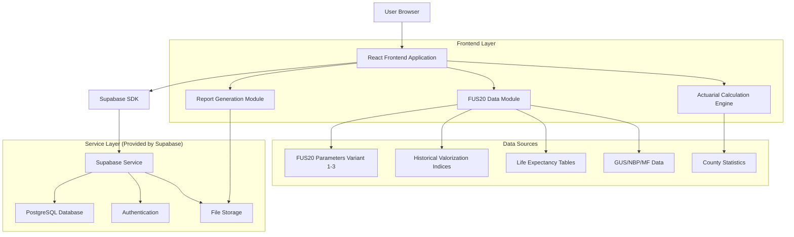
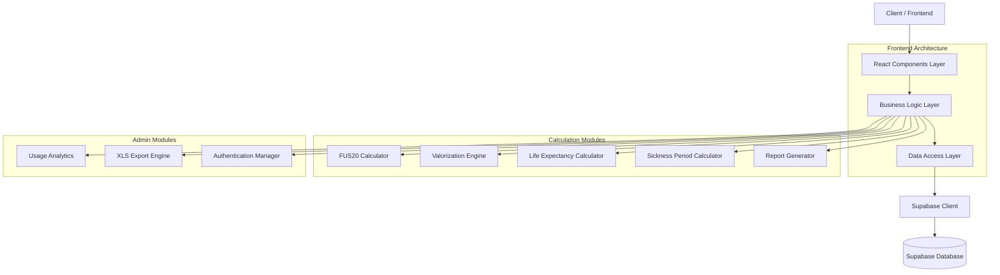
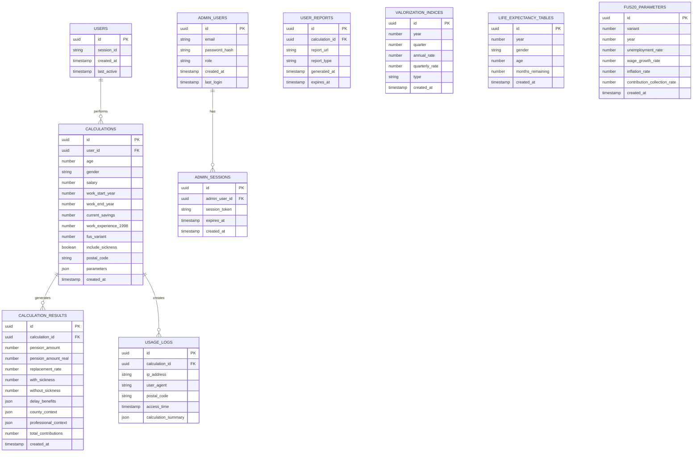

# Architektura Techniczna - Symulator Emerytalny ZUS

## 1. Architecture design



## 2. Technology Description

- **Frontend**: React@18 + TypeScript + TailwindCSS@3 + Vite + Chart.js + jsPDF
- **Backend**: Supabase (Authentication, Database, Storage)
- **Data Processing**: Custom JavaScript modules for actuarial calculations
- **Accessibility**: React-aria components for WCAG 2.0 compliance
- **State Management**: React Context API + useReducer
- **Form Handling**: React Hook Form with Zod validation
- **Report Generation**: jsPDF for user reports, SheetJS for admin XLS exports

## 3. Route definitions

| Route | Purpose |
|-------|---------|
| / | Pulpit Podstawowy (1.1) - wprowadzenie oczekiwanej emerytury, wizualizacja grup, ciekawostki |
| /formularz | Symulacja Emerytury (1.2) - formularz z walidacją, oszacowanie środków, kalkulacja CP, opcja zwolnień |
| /wyniki | Prezentacja prognozy emerytury z analizami i kontekstem, pobieranie raportu PDF, kod pocztowy |
| /dashboard | Dashboard zaawansowany z kontrolą założeń aktuarialnych i wariantów FUS20 |
| /admin | Panel administracyjny dla użytkowników ZUS z raportami XLS |
| /admin/login | Logowanie administratora ZUS |
| /admin/reports | Generowanie i pobieranie raportów administracyjnych XLS |

## 4. API definitions

### 4.1 Core API

**Kalkulacja emerytury**
```
POST /api/calculate-pension
```

Request:
| Param Name | Param Type | isRequired | Description |
|------------|------------|------------|-------------|
| age | number | true | Wiek użytkownika |
| gender | string | true | Płeć (M/F) |
| salary | number | true | Wysokość wynagrodzenia brutto |
| workStartYear | number | true | Rok rozpoczęcia pracy |
| workEndYear | number | true | Planowany rok zakończenia pracy |
| currentSavings | number | false | Zgromadzone środki na koncie ZUS |
| workExperience1998 | number | false | Staż składkowy/nieskładkowy na 31.12.1998 |
| includeSickness | boolean | false | Uwzględnienie zwolnień lekarskich |
| expectedPension | number | false | Oczekiwana wysokość emerytury |
| fusVariant | number | true | Wariant FUS20 (1, 2, 3) |
| postalCode | string | false | Kod pocztowy dla celów statystycznych |

Response:
| Param Name | Param Type | Description |
|------------|------------|-------------|
| pensionAmount | number | Prognozowana wysokość emerytury |
| pensionAmountReal | number | Emerytura rzeczywista (zdyskontowana inflacją) |
| replacementRate | number | Stopa zastąpienia |
| withSickness | number | Emerytura z uwzględnieniem chorobowego |
| withoutSickness | number | Emerytura bez uwzględnienia chorobowego |
| delayBenefits | object | Korzyści z odroczenia emerytury (1, 2, 5 lat) |
| initialCapital | number | Obliczony kapitał początkowy |
| estimatedSavings | number | Oszacowane środki ZUS (jeśli nie podano) |
| sicknessImpact | object | Wpływ zwolnień na świadczenie |
| countyContext | object | Kontekst powiatowy (najwyższa, najniższa, przeciętna emerytura) |
| professionalContext | object | Kontekst zawodowy (przeciętne emerytury dla kodów tytułu ubezpieczenia) |
| totalContributions | number | Łączne składki |

**Pobieranie danych referencyjnych**
```
GET /api/reference-data
```

Response:
| Param Name | Param Type | Description |
|------------|------------|-------------|
| valorization | array | Historyczne wskaźniki waloryzacji (roczne i kwartalne) |
| lifeExpectancy | array | Tablice dalszego trwania życia (w miesiącach) |
| fusParameters | object | Parametry FUS20 dla wszystkich wariantów (2023-2080) |
| sicknessData | object | Średnia długość absencji chorobowej wg wieku i płci |
| countyData | object | Statystyki emerytalne wg powiatów |

**Generowanie raportu użytkownika**
```
POST /api/generate-user-report
```

Request:
| Param Name | Param Type | isRequired | Description |
|------------|------------|------------|-------------|
| calculationId | string | true | ID kalkulacji |
| includeCharts | boolean | true | Czy dołączyć wykresy |
| postalCode | string | false | Kod pocztowy |

Response:
| Param Name | Param Type | Description |
|------------|------------|-------------|
| reportUrl | string | URL do pobrania raportu PDF |
| reportId | string | ID wygenerowanego raportu |

**Raportowanie administracyjne**
```
POST /api/admin/usage-report
```

Request:
| Param Name | Param Type | isRequired | Description |
|------------|------------|------------|-------------|
| dateFrom | string | true | Data początkowa raportu |
| dateTo | string | true | Data końcowa raportu |
| format | string | true | Format raportu (XLS) |

Response:
| Param Name | Param Type | Description |
|------------|------------|-------------|
| reportUrl | string | URL do pobrania raportu XLS |
| recordCount | number | Liczba rekordów w raporcie |

**Logowanie użycia**
```
POST /api/log-usage
```

Request:
| Param Name | Param Type | isRequired | Description |
|------------|------------|------------|-------------|
| calculationData | object | true | Dane kalkulacji |
| results | object | true | Wyniki kalkulacji |
| postalCode | string | false | Kod pocztowy |
| timestamp | string | true | Czas użycia |

## 5. Server architecture diagram



## 6. Data model

### 6.1 Data model definition



### 6.2 Data Definition Language

**Tabela użytkowników (users)**
```sql
-- create table
CREATE TABLE users (
    id UUID PRIMARY KEY DEFAULT gen_random_uuid(),
    session_id VARCHAR(255) UNIQUE,
    created_at TIMESTAMP WITH TIME ZONE DEFAULT NOW(),
    last_active TIMESTAMP WITH TIME ZONE DEFAULT NOW()
);

-- create index
CREATE INDEX idx_users_session_id ON users(session_id);
CREATE INDEX idx_users_last_active ON users(last_active DESC);
```

**Tabela kalkulacji (calculations)**
```sql
-- create table
CREATE TABLE calculations (
    id UUID PRIMARY KEY DEFAULT gen_random_uuid(),
    user_id UUID REFERENCES users(id),
    age INTEGER NOT NULL,
    gender VARCHAR(1) NOT NULL CHECK (gender IN ('M', 'F')),
    salary DECIMAL(10,2) NOT NULL,
    work_start_year INTEGER NOT NULL,
    work_end_year INTEGER NOT NULL,
    current_savings DECIMAL(12,2),
    work_experience_1998 INTEGER,
    fus_variant INTEGER NOT NULL CHECK (fus_variant IN (1, 2, 3)),
    include_sickness BOOLEAN DEFAULT FALSE,
    postal_code VARCHAR(6),
    parameters JSONB,
    created_at TIMESTAMP WITH TIME ZONE DEFAULT NOW()
);

-- create indexes
CREATE INDEX idx_calculations_user_id ON calculations(user_id);
CREATE INDEX idx_calculations_created_at ON calculations(created_at DESC);
CREATE INDEX idx_calculations_postal_code ON calculations(postal_code);
```

**Tabela wyników kalkulacji (calculation_results)**
```sql
-- create table
CREATE TABLE calculation_results (
    id UUID PRIMARY KEY DEFAULT gen_random_uuid(),
    calculation_id UUID REFERENCES calculations(id) ON DELETE CASCADE,
    pension_amount DECIMAL(10,2) NOT NULL,
    pension_amount_real DECIMAL(10,2) NOT NULL,
    replacement_rate DECIMAL(5,2) NOT NULL,
    with_sickness DECIMAL(10,2),
    without_sickness DECIMAL(10,2),
    delay_benefits JSONB,
    county_context JSONB,
    professional_context JSONB,
    total_contributions DECIMAL(12,2),
    created_at TIMESTAMP WITH TIME ZONE DEFAULT NOW()
);

-- create indexes
CREATE INDEX idx_calculation_results_calculation_id ON calculation_results(calculation_id);
CREATE INDEX idx_calculation_results_pension_amount ON calculation_results(pension_amount DESC);
```

**Tabela logów użycia (usage_logs)**
```sql
-- create table
CREATE TABLE usage_logs (
    id UUID PRIMARY KEY DEFAULT gen_random_uuid(),
    calculation_id UUID REFERENCES calculations(id),
    ip_address INET,
    user_agent TEXT,
    postal_code VARCHAR(6),
    access_time TIMESTAMP WITH TIME ZONE DEFAULT NOW(),
    calculation_summary JSONB
);

-- create indexes
CREATE INDEX idx_usage_logs_access_time ON usage_logs(access_time DESC);
CREATE INDEX idx_usage_logs_postal_code ON usage_logs(postal_code);
CREATE INDEX idx_usage_logs_calculation_id ON usage_logs(calculation_id);
```

**Tabela administratorów (admin_users)**
```sql
-- create table
CREATE TABLE admin_users (
    id UUID PRIMARY KEY DEFAULT gen_random_uuid(),
    email VARCHAR(255) UNIQUE NOT NULL,
    password_hash VARCHAR(255) NOT NULL,
    role VARCHAR(50) DEFAULT 'admin' CHECK (role IN ('admin', 'super_admin')),
    created_at TIMESTAMP WITH TIME ZONE DEFAULT NOW(),
    last_login TIMESTAMP WITH TIME ZONE
);

-- create indexes
CREATE INDEX idx_admin_users_email ON admin_users(email);
CREATE INDEX idx_admin_users_last_login ON admin_users(last_login DESC);
```

**Tabela raportów użytkowników (user_reports)**
```sql
-- create table
CREATE TABLE user_reports (
    id UUID PRIMARY KEY DEFAULT gen_random_uuid(),
    calculation_id UUID REFERENCES calculations(id),
    report_url TEXT NOT NULL,
    report_type VARCHAR(10) DEFAULT 'PDF' CHECK (report_type IN ('PDF', 'XLS')),
    generated_at TIMESTAMP WITH TIME ZONE DEFAULT NOW(),
    expires_at TIMESTAMP WITH TIME ZONE DEFAULT (NOW() + INTERVAL '7 days')
);

-- create indexes
CREATE INDEX idx_user_reports_calculation_id ON user_reports(calculation_id);
CREATE INDEX idx_user_reports_expires_at ON user_reports(expires_at);
```

**Uprawnienia Supabase**
```sql
-- Grant basic access to anon role
GRANT SELECT ON users TO anon;
GRANT INSERT ON users TO anon;
GRANT SELECT, INSERT ON calculations TO anon;
GRANT SELECT, INSERT ON calculation_results TO anon;
GRANT SELECT, INSERT ON usage_logs TO anon;
GRANT SELECT, INSERT ON user_reports TO anon;

-- Grant full access to authenticated role
GRANT ALL PRIVILEGES ON users TO authenticated;
GRANT ALL PRIVILEGES ON calculations TO authenticated;
GRANT ALL PRIVILEGES ON calculation_results TO authenticated;
GRANT ALL PRIVILEGES ON usage_logs TO authenticated;
GRANT ALL PRIVILEGES ON admin_users TO authenticated;
GRANT ALL PRIVILEGES ON admin_sessions TO authenticated;
GRANT ALL PRIVILEGES ON user_reports TO authenticated;
```

## 7. Kluczowe Dane FUS20 - Implementacja

### 7.1 Struktura Danych FUS20 Wariant 1 (Pośredni)

```javascript
const FUS20_VARIANT_1 = {
  source: "Prognoza Ministerstwa Finansów z 2022 r.",
  variant: 1,
  name: "Pośredni",
  forecastPeriod: "2023-2080",
  
  macroeconomicData: [
    { year: 2023, unemploymentRate: 5.40, realWageGrowth: 100.30, contributionCollection: 99.00 },
    { year: 2025, unemploymentRate: 5.00, realWageGrowth: 103.70, contributionCollection: 99.00 },
    { year: 2040, unemploymentRate: 5.00, realWageGrowth: 102.70, contributionCollection: 99.00 },
    { year: 2080, unemploymentRate: 5.00, realWageGrowth: 102.00, contributionCollection: 99.00 }
  ],
  
  forecastResults: [
    { year: 2023, annualBalance: -59575, revenues: 145016, expenditures: 204591 },
    { year: 2030, annualBalance: -93104, revenues: 177027, expenditures: 270131 },
    { year: 2052, note: "Największa wartość deficytu zdyskontowanego: 93,1 mld zł" },
    { year: 2080, annualBalance: -52121, revenues: 372457, expenditures: 424578 }
  ],
  
  efficiencyBurden: [
    { year: 2023, efficiency: 71, burdenCoefficient: 0.40 },
    { year: 2060, efficiency: 78, burdenCoefficient: 0.81 },
    { year: 2080, efficiency: 88, burdenCoefficient: 0.84, note: "wzrost o 16,8 p.p. od 2023 r." }
  ]
};
```

### 7.2 Struktura Raportu Administracyjnego XLS

```javascript
const ADMIN_REPORT_HEADERS = [
  "Data użycia",
  "Godzina użycia", 
  "Emerytura oczekiwana",
  "Wiek",
  "Płeć",
  "Wysokość wynagrodzenia",
  "Czy uwzględniał okresy choroby",
  "Wysokość zgromadzonych środków na koncie i Subkoncie",
  "Emerytura rzeczywista",
  "Emerytura urealniona",
  "Kod pocztowy"
];
```

