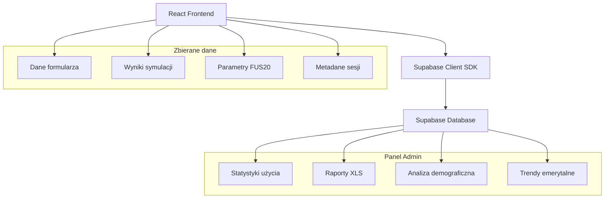

# Integracja Supabase - ZUS na Plus

## 1. Przegląd integracji

### 1.1 Cel integracji
Integracja Supabase ma na celu zbieranie danych użytkowników symulatora emerytalnego bez konieczności autoryzacji, w celu zasilenia panelu administracyjnego danymi analitycznymi na potrzeby hackathonu.

### 1.2 Architektura danych


## 2. Struktura bazy danych

### 2.1 Tabela: user_simulations
Główna tabela przechowująca dane symulacji użytkowników.

```sql
CREATE TABLE user_simulations (
    id UUID PRIMARY KEY DEFAULT gen_random_uuid(),
    
    -- Dane wejściowe użytkownika
    age INTEGER NOT NULL,
    gender VARCHAR(1) NOT NULL CHECK (gender IN ('M', 'F')),
    salary DECIMAL(10,2) NOT NULL,
    work_start_year INTEGER NOT NULL,
    work_end_year INTEGER NOT NULL,
    current_savings DECIMAL(12,2),
    work_experience_1998 INTEGER,
    include_sickness BOOLEAN DEFAULT false,
    expected_pension DECIMAL(10,2),
    postal_code VARCHAR(6),
    
    -- Parametry FUS20 i Dashboard
    fus20_variant INTEGER NOT NULL CHECK (fus20_variant IN (1, 2, 3)),
    unemployment_rate DECIMAL(5,2),
    real_wage_growth DECIMAL(5,2),
    inflation_rate DECIMAL(5,2),
    contribution_collection DECIMAL(5,2),
    
    -- Wyniki symulacji
    pension_amount DECIMAL(10,2) NOT NULL,
    pension_amount_real DECIMAL(10,2),
    replacement_rate DECIMAL(5,2),
    with_sickness DECIMAL(10,2),
    without_sickness DECIMAL(10,2),
    initial_capital DECIMAL(12,2),
    estimated_savings DECIMAL(12,2),
    total_contributions DECIMAL(12,2),
    
    -- Metadane
    session_id VARCHAR(50),
    user_agent TEXT,
    ip_address INET,
    created_at TIMESTAMP WITH TIME ZONE DEFAULT NOW(),
    calculation_duration_ms INTEGER,
    
    -- Indeksy dla wydajności
    CONSTRAINT valid_age CHECK (age >= 18 AND age <= 100),
    CONSTRAINT valid_years CHECK (work_end_year >= work_start_year)
);

-- Indeksy
CREATE INDEX idx_user_simulations_created_at ON user_simulations(created_at DESC);
CREATE INDEX idx_user_simulations_fus20_variant ON user_simulations(fus20_variant);
CREATE INDEX idx_user_simulations_age_gender ON user_simulations(age, gender);
CREATE INDEX idx_user_simulations_postal_code ON user_simulations(postal_code);
```

### 2.2 Tabela: simulation_delays
Dane o korzyściach z odroczenia emerytury.

```sql
CREATE TABLE simulation_delays (
    id UUID PRIMARY KEY DEFAULT gen_random_uuid(),
    simulation_id UUID REFERENCES user_simulations(id) ON DELETE CASCADE,
    
    delay_years INTEGER NOT NULL CHECK (delay_years IN (1, 2, 5)),
    delayed_pension_amount DECIMAL(10,2) NOT NULL,
    benefit_increase_percent DECIMAL(5,2) NOT NULL,
    
    created_at TIMESTAMP WITH TIME ZONE DEFAULT NOW()
);

CREATE INDEX idx_simulation_delays_simulation_id ON simulation_delays(simulation_id);
```

### 2.3 Tabela: county_context
Kontekst powiatowy dla symulacji.

```sql
CREATE TABLE county_context (
    id UUID PRIMARY KEY DEFAULT gen_random_uuid(),
    simulation_id UUID REFERENCES user_simulations(id) ON DELETE CASCADE,
    
    county_name VARCHAR(100),
    highest_pension DECIMAL(10,2),
    lowest_pension DECIMAL(10,2),
    average_pension DECIMAL(10,2),
    user_vs_average_percent DECIMAL(5,2),
    
    created_at TIMESTAMP WITH TIME ZONE DEFAULT NOW()
);

CREATE INDEX idx_county_context_simulation_id ON county_context(simulation_id);
```

### 2.4 Tabela: professional_context
Kontekst zawodowy dla symulacji.

```sql
CREATE TABLE professional_context (
    id UUID PRIMARY KEY DEFAULT gen_random_uuid(),
    simulation_id UUID REFERENCES user_simulations(id) ON DELETE CASCADE,
    
    insurance_title_code VARCHAR(10),
    profession_name VARCHAR(200),
    average_pension DECIMAL(10,2),
    user_vs_profession_percent DECIMAL(5,2),
    
    created_at TIMESTAMP WITH TIME ZONE DEFAULT NOW()
);

CREATE INDEX idx_professional_context_simulation_id ON professional_context(simulation_id);
```

### 2.5 Tabela: system_usage_logs
Logi użycia systemu dla celów analitycznych.

```sql
CREATE TABLE system_usage_logs (
    id UUID PRIMARY KEY DEFAULT gen_random_uuid(),
    
    event_type VARCHAR(50) NOT NULL, -- 'form_start', 'calculation_complete', 'report_download', 'dashboard_access'
    page_path VARCHAR(200),
    session_id VARCHAR(50),
    user_agent TEXT,
    ip_address INET,
    
    -- Dodatkowe dane kontekstowe
    event_data JSONB,
    
    created_at TIMESTAMP WITH TIME ZONE DEFAULT NOW()
);

CREATE INDEX idx_system_usage_logs_created_at ON system_usage_logs(created_at DESC);
CREATE INDEX idx_system_usage_logs_event_type ON system_usage_logs(event_type);
CREATE INDEX idx_system_usage_logs_session_id ON system_usage_logs(session_id);
```

## 3. Konfiguracja Supabase

### 3.1 Zmienne środowiskowe
```env
VITE_SUPABASE_URL=https://your-project.supabase.co
VITE_SUPABASE_ANON_KEY=your-anon-key
```

### 3.2 Konfiguracja klienta Supabase
```typescript
// src/utils/supabaseClient.ts
import { createClient } from '@supabase/supabase-js'

const supabaseUrl = import.meta.env.VITE_SUPABASE_URL
const supabaseAnonKey = import.meta.env.VITE_SUPABASE_ANON_KEY

export const supabase = createClient(supabaseUrl, supabaseAnonKey, {
  auth: {
    persistSession: false, // Brak autoryzacji
    autoRefreshToken: false,
  }
})
```

### 3.3 Uprawnienia RLS (Row Level Security)
```sql
-- Wyłączenie RLS dla tabel publicznych (hackathon)
ALTER TABLE user_simulations DISABLE ROW LEVEL SECURITY;
ALTER TABLE simulation_delays DISABLE ROW LEVEL SECURITY;
ALTER TABLE county_context DISABLE ROW LEVEL SECURITY;
ALTER TABLE professional_context DISABLE ROW LEVEL SECURITY;
ALTER TABLE system_usage_logs DISABLE ROW LEVEL SECURITY;

-- Uprawnienia dla roli anon (publiczny dostęp do zapisu)
GRANT INSERT ON user_simulations TO anon;
GRANT INSERT ON simulation_delays TO anon;
GRANT INSERT ON county_context TO anon;
GRANT INSERT ON professional_context TO anon;
GRANT INSERT ON system_usage_logs TO anon;

-- Uprawnienia dla roli authenticated (panel admin)
GRANT ALL PRIVILEGES ON user_simulations TO authenticated;
GRANT ALL PRIVILEGES ON simulation_delays TO authenticated;
GRANT ALL PRIVILEGES ON county_context TO authenticated;
GRANT ALL PRIVILEGES ON professional_context TO authenticated;
GRANT ALL PRIVILEGES ON system_usage_logs TO authenticated;
```

## 4. Implementacja zbierania danych

### 4.1 Service do zapisywania symulacji
```typescript
// src/utils/supabaseService.ts
import { supabase } from './supabaseClient'

export interface SimulationData {
  // Dane wejściowe
  age: number
  gender: 'M' | 'F'
  salary: number
  workStartYear: number
  workEndYear: number
  currentSavings?: number
  workExperience1998?: number
  includeSickness?: boolean
  expectedPension?: number
  postalCode?: string
  
  // Parametry FUS20
  fus20Variant: number
  unemploymentRate?: number
  realWageGrowth?: number
  inflationRate?: number
  contributionCollection?: number
  
  // Wyniki
  pensionAmount: number
  pensionAmountReal?: number
  replacementRate?: number
  withSickness?: number
  withoutSickness?: number
  initialCapital?: number
  estimatedSavings?: number
  totalContributions?: number
  
  // Metadane
  sessionId?: string
  calculationDurationMs?: number
}

export const saveSimulation = async (data: SimulationData) => {
  try {
    const { data: simulation, error } = await supabase
      .from('user_simulations')
      .insert({
        age: data.age,
        gender: data.gender,
        salary: data.salary,
        work_start_year: data.workStartYear,
        work_end_year: data.workEndYear,
        current_savings: data.currentSavings,
        work_experience_1998: data.workExperience1998,
        include_sickness: data.includeSickness || false,
        expected_pension: data.expectedPension,
        postal_code: data.postalCode,
        fus20_variant: data.fus20Variant,
        unemployment_rate: data.unemploymentRate,
        real_wage_growth: data.realWageGrowth,
        inflation_rate: data.inflationRate,
        contribution_collection: data.contributionCollection,
        pension_amount: data.pensionAmount,
        pension_amount_real: data.pensionAmountReal,
        replacement_rate: data.replacementRate,
        with_sickness: data.withSickness,
        without_sickness: data.withoutSickness,
        initial_capital: data.initialCapital,
        estimated_savings: data.estimatedSavings,
        total_contributions: data.totalContributions,
        session_id: data.sessionId || generateSessionId(),
        user_agent: navigator.userAgent,
        calculation_duration_ms: data.calculationDurationMs
      })
      .select()
      .single()

    if (error) throw error
    return simulation
  } catch (error) {
    console.error('Błąd zapisywania symulacji:', error)
    throw error
  }
}

export const saveDelayBenefits = async (simulationId: string, delays: Array<{
  delayYears: number
  delayedPensionAmount: number
  benefitIncreasePercent: number
}>) => {
  try {
    const delayData = delays.map(delay => ({
      simulation_id: simulationId,
      delay_years: delay.delayYears,
      delayed_pension_amount: delay.delayedPensionAmount,
      benefit_increase_percent: delay.benefitIncreasePercent
    }))

    const { error } = await supabase
      .from('simulation_delays')
      .insert(delayData)

    if (error) throw error
  } catch (error) {
    console.error('Błąd zapisywania korzyści z odroczenia:', error)
    throw error
  }
}

export const logSystemUsage = async (eventType: string, eventData?: any) => {
  try {
    await supabase
      .from('system_usage_logs')
      .insert({
        event_type: eventType,
        page_path: window.location.pathname,
        session_id: getSessionId(),
        user_agent: navigator.userAgent,
        event_data: eventData
      })
  } catch (error) {
    console.error('Błąd logowania użycia:', error)
  }
}

const generateSessionId = () => {
  return `session_${Date.now()}_${Math.random().toString(36).substr(2, 9)}`
}

const getSessionId = () => {
  let sessionId = sessionStorage.getItem('zus_session_id')
  if (!sessionId) {
    sessionId = generateSessionId()
    sessionStorage.setItem('zus_session_id', sessionId)
  }
  return sessionId
}
```

### 4.2 Integracja z FormPage.tsx
```typescript
// Modyfikacja w src/pages/FormPage.tsx
import { saveSimulation, saveDelayBenefits, logSystemUsage } from '../utils/supabaseService'

// W funkcji onSubmit
const onSubmit = async (data: FormData) => {
  const startTime = Date.now()
  
  try {
    // Logowanie rozpoczęcia kalkulacji
    await logSystemUsage('calculation_start', { formData: data })
    
    // Istniejąca logika kalkulacji...
    const results = calculatePension(personData, fus20Params)
    
    const calculationDuration = Date.now() - startTime
    
    // Zapisanie symulacji do Supabase
    const simulationData = {
      ...data,
      ...results,
      fus20Variant: dashboardParameters.fus20Variant || 1,
      unemploymentRate: dashboardParameters.unemploymentRate,
      realWageGrowth: dashboardParameters.realWageGrowth,
      inflationRate: dashboardParameters.inflationRate,
      contributionCollection: dashboardParameters.contributionCollection,
      calculationDurationMs: calculationDuration
    }
    
    const savedSimulation = await saveSimulation(simulationData)
    
    // Zapisanie korzyści z odroczenia
    if (results.delayBenefits) {
      await saveDelayBenefits(savedSimulation.id, results.delayBenefits)
    }
    
    // Logowanie zakończenia kalkulacji
    await logSystemUsage('calculation_complete', { 
      simulationId: savedSimulation.id,
      pensionAmount: results.pensionAmount 
    })
    
    // Przekierowanie do wyników...
    navigate('/wyniki', { state: { results, personData } })
    
  } catch (error) {
    console.error('Błąd podczas kalkulacji:', error)
    await logSystemUsage('calculation_error', { error: error.message })
  }
}
```

## 5. Panel administracyjny - integracja z danymi

### 5.1 Service do pobierania danych analitycznych
```typescript
// src/utils/adminService.ts
import { supabase } from './supabaseClient'

export const getSystemStats = async () => {
  try {
    // Łączna liczba symulacji
    const { count: totalSimulations } = await supabase
      .from('user_simulations')
      .select('*', { count: 'exact', head: true })

    // Symulacje dzisiaj
    const today = new Date().toISOString().split('T')[0]
    const { count: simulationsToday } = await supabase
      .from('user_simulations')
      .select('*', { count: 'exact', head: true })
      .gte('created_at', `${today}T00:00:00`)

    // Średni czas kalkulacji
    const { data: avgTime } = await supabase
      .from('user_simulations')
      .select('calculation_duration_ms')
      .not('calculation_duration_ms', 'is', null)

    const avgResponseTime = avgTime?.length > 0 
      ? avgTime.reduce((sum, item) => sum + item.calculation_duration_ms, 0) / avgTime.length / 1000
      : 0

    return {
      totalSimulations: totalSimulations || 0,
      simulationsToday: simulationsToday || 0,
      avgResponseTime: Math.round(avgResponseTime * 100) / 100
    }
  } catch (error) {
    console.error('Błąd pobierania statystyk:', error)
    return {
      totalSimulations: 0,
      simulationsToday: 0,
      avgResponseTime: 0
    }
  }
}

export const getDemographicData = async () => {
  try {
    const { data } = await supabase
      .from('user_simulations')
      .select('age, gender, fus20_variant, created_at')
      .order('created_at', { ascending: false })
      .limit(1000)

    return data || []
  } catch (error) {
    console.error('Błąd pobierania danych demograficznych:', error)
    return []
  }
}

export const getUsageAnalytics = async (days: number = 7) => {
  try {
    const startDate = new Date()
    startDate.setDate(startDate.getDate() - days)

    const { data } = await supabase
      .from('user_simulations')
      .select('created_at, pension_amount, fus20_variant')
      .gte('created_at', startDate.toISOString())
      .order('created_at', { ascending: true })

    return data || []
  } catch (error) {
    console.error('Błąd pobierania analityki użycia:', error)
    return []
  }
}

export const exportSimulationsData = async (dateFrom: string, dateTo: string) => {
  try {
    const { data } = await supabase
      .from('user_simulations')
      .select(`
        *,
        simulation_delays(*),
        county_context(*),
        professional_context(*)
      `)
      .gte('created_at', dateFrom)
      .lte('created_at', dateTo)
      .order('created_at', { ascending: false })

    return data || []
  } catch (error) {
    console.error('Błąd eksportu danych:', error)
    return []
  }
}
```

### 5.2 Modyfikacja AdminPage.tsx
```typescript
// Dodanie do src/pages/AdminPage.tsx
import { getSystemStats, getDemographicData, getUsageAnalytics } from '../utils/adminService'

const AdminPage: React.FC = () => {
  const [systemStats, setSystemStats] = useState({
    totalSimulations: 0,
    simulationsToday: 0,
    avgResponseTime: 0
  })
  const [demographicData, setDemographicData] = useState([])
  const [usageData, setUsageData] = useState([])

  useEffect(() => {
    loadAdminData()
  }, [])

  const loadAdminData = async () => {
    try {
      const [stats, demographic, usage] = await Promise.all([
        getSystemStats(),
        getDemographicData(),
        getUsageAnalytics(7)
      ])
      
      setSystemStats(stats)
      setDemographicData(demographic)
      setUsageData(usage)
    } catch (error) {
      console.error('Błąd ładowania danych admin:', error)
    }
  }

  // Reszta komponentu...
}
```

## 6. Instalacja i konfiguracja

### 6.1 Instalacja pakietów
```bash
npm install @supabase/supabase-js
```

### 6.2 Konfiguracja projektu Supabase
1. Utwórz nowy projekt w Supabase
2. Skopiuj URL projektu i klucz anon
3. Wykonaj skrypty SQL z sekcji 2
4. Skonfiguruj zmienne środowiskowe

### 6.3 Deployment
```bash
# Dodaj zmienne środowiskowe do Vercel
vercel env add VITE_SUPABASE_URL
vercel env add VITE_SUPABASE_ANON_KEY

# Deploy
vercel --prod
```

## 7. Monitorowanie i analityka

### 7.1 Kluczowe metryki
- Liczba symulacji dziennie/miesięcznie
- Rozkład wieku i płci użytkowników
- Popularność wariantów FUS20
- Średnie wysokości prognozowanych emerytur
- Czas wykonywania kalkulacji
- Błędy systemu

### 7.2 Raporty dla hackathonu
- Raport użycia systemu (XLS)
- Analiza demograficzna użytkowników
- Trendy w prognozach emerytalnych
- Porównanie wariantów FUS20
- Statystyki regionalne (kody pocztowe)

## 8. Bezpieczeństwo i prywatność

### 8.1 Ochrona danych
- Brak przechowywania danych osobowych (imię, nazwisko)
- Anonimizacja adresów IP
- Opcjonalne podawanie kodu pocztowego
- Automatyczne usuwanie starych danych (po hackathonie)

### 8.2 Zgodność z RODO
- Informacja o zbieraniu danych analitycznych
- Możliwość opt-out z logowania
- Minimalizacja zbieranych danych
- Przejrzystość celów przetwarzania

## 9. Testowanie

### 9.1 Testy integracji
```typescript
// src/tests/supabase.test.ts
import { saveSimulation, getSystemStats } from '../utils/supabaseService'

describe('Supabase Integration', () => {
  test('should save simulation data', async () => {
    const testData = {
      age: 35,
      gender: 'M' as const,
      salary: 5000,
      workStartYear: 2010,
      workEndYear: 2045,
      fus20Variant: 1,
      pensionAmount: 2500
    }
    
    const result = await saveSimulation(testData)
    expect(result.id).toBeDefined()
    expect(result.age).toBe(35)
  })
  
  test('should get system statistics', async () => {
    const stats = await getSystemStats()
    expect(stats.totalSimulations).toBeGreaterThanOrEqual(0)
    expect(stats.simulationsToday).toBeGreaterThanOrEqual(0)
  })
})
```

## 10. Roadmap po hackathonie

### 10.1 Rozszerzenia funkcjonalności
- Autoryzacja użytkowników
- Zapisywanie historii symulacji
- Porównywanie scenariuszy
- Powiadomienia o zmianach w przepisach
- API dla zewnętrznych integracji

### 10.2 Optymalizacje
- Indeksowanie bazy danych
- Cache'owanie wyników
- Kompresja danych historycznych
- Monitoring wydajności
- Backup i disaster recovery