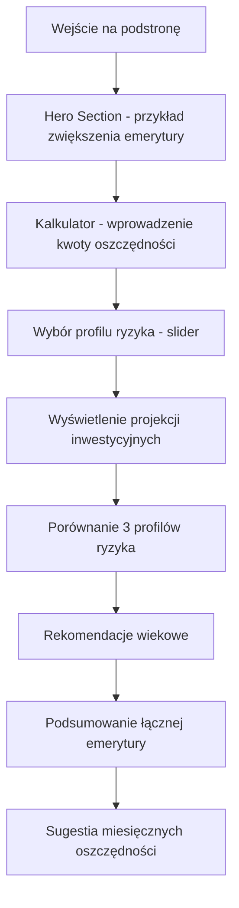

# PRD - Alternatywne Oszczędzanie na Emeryturę

## 1. Product Overview

Podstrona "Alternatywne Oszczędzanie na Emeryturę" to skondensowana "pigułka informacyjna" w aplikacji ZUS na Plus, która pomaga użytkownikom zrozumieć i zaplanować dodatkowe oszczędności emerytalne uzupełniające świadczenia ZUS.

- Główny cel: Edukacja użytkowników o metodach zwiększenia przyszłych dochodów emerytalnych o 50-200% w stosunku do samej emerytury ZUS
- Grupa docelowa: Osoby planujące emeryturę, które chcą uzupełnić świadczenia ZUS dodatkowymi oszczędnościami
- Wartość biznesowa: Zwiększenie świadomości finansowej obywateli i promocja długoterminowego planowania emerytalnego

## 2. Core Features

### 2.1 User Roles
Podstrona nie wymaga rozróżnienia ról użytkowników - dostępna dla wszystkich użytkowników aplikacji ZUS na Plus.

### 2.2 Feature Module

Podstrona składa się z jednej strony z pionowym scrollem zawierającej:

1. **Hero Section**: wprowadzenie i wizualizacja potencjału oszczędności
2. **Interaktywny Kalkulator**: główne narzędzie do obliczania dodatkowych oszczędności
3. **Porównanie Metod**: wizualne karty z 3 profilami ryzyka
4. **Rekomendacje Wiekowe**: strategia alokacji aktywów według wieku użytkownika
5. **Integracja ZUS**: podsumowanie łącznej emerytury (ZUS + oszczędności)

### 2.3 Page Details

| Page Name | Module Name | Feature description |
|-----------|-------------|---------------------|
| Alternatywne Oszczędzanie | Hero Section | Wyświetl krótkie wprowadzenie z przykładem zwiększenia emerytury. Pokaż wizualizację "Twoja prognoza ZUS → Z oszczędnościami". Użyj animowanych liczników. |
| Alternatywne Oszczędzanie | Kalkulator Oszczędności | Umożliw wprowadzenie miesięcznej kwoty oszczędności, lat do emerytury, wybór profilu ryzyka. Oblicz i wyświetl projekcje dla różnych metod inwestycyjnych. Integruj z danymi prognozy ZUS użytkownika. |
| Alternatywne Oszczędzanie | Porównanie Metod | Wyświetl 3 karty profilów ryzyka: Bezpieczny (lokaty, obligacje), Zrównoważony (fundusze, ETF, IKE/IKZE), Agresywny (akcje, nieruchomości, krypto). Pokaż oczekiwane zwroty i poziom ryzyka. |
| Alternatywne Oszczędzanie | Rekomendacje Wiekowe | Wyświetl strategię alokacji aktywów według wieku: 20-35 lat (70% akcje), 35-50 lat (50% akcje), 50-65 lat (30% akcje). Dostosuj rekomendacje do wieku użytkownika. |
| Alternatywne Oszczędzanie | Integracja ZUS | Pokaż łączną emeryturę (ZUS + oszczędności). Oblicz ile brakuje do docelowej kwoty. Zasugeruj miesięczną kwotę oszczędności potrzebną do osiągnięcia celu. |

## 3. Core Process

**Główny przepływ użytkownika:**

1. Użytkownik wchodzi na podstronę i widzi Hero Section z przykładem zwiększenia emerytury
2. Przewija do kalkulatora i wprowadza miesięczną kwotę oszczędności
3. Wybiera profil ryzyka za pomocą interaktywnego slidera
4. System oblicza i wyświetla projekcje dla różnych metod inwestycyjnych
5. Użytkownik przegląda porównanie 3 profilów ryzyka w formie kart
6. System pokazuje rekomendacje wiekowe dostosowane do wieku użytkownika
7. Użytkownik widzi podsumowanie łącznej emerytury (ZUS + oszczędności)
8. System sugeruje konkretną kwotę miesięcznych oszczędności do osiągnięcia celu

## 4. User Interface Design

### 4.1 Design Style

- **Kolory główne**: Zielony ZUS (#00A651), Granatowy ZUS (#1E3A8A)
- **Kolory pomocnicze**: Jasny zielony (#E8F5ED), Szary ZUS (#4B5563)
- **Styl przycisków**: Zaokrąglone (rounded-lg), gradient zielony, hover effects
- **Czcionka**: Inter, rozmiary 14-24px, font-weight 400-700
- **Layout**: Jedna strona z pionowym scrollem, sekcje w kartach z cieniami
- **Ikony**: Lucide React - Calculator, TrendingUp, Shield, PiggyBank, BarChart3
- **Animacje**: Liczniki animowane, progress bary, smooth scroll, hover transforms

### 4.2 Page Design Overview

| Page Name | Module Name | UI Elements |
|-----------|-------------|-------------|
| Alternatywne Oszczędzanie | Hero Section | Gradient zielony tło, duży tytuł (24px, bold), animowane liczniki, porównanie "przed → po", ikona TrendingUp |
| Alternatywne Oszczędzanie | Kalkulator Oszczędności | Biała karta z cieniem, input fields z zielonymi borderami, slider profilu ryzyka, wyniki w kolorowych kartach, ikona Calculator |
| Alternatywne Oszczędzanie | Porównanie Metod | 3 karty obok siebie (grid), każda z innym kolorem akcentu, ikony dla każdej metody, progress bary dla ryzyka/zysku |
| Alternatywne Oszczędzanie | Rekomendacje Wiekowe | Wykres kołowy alokacji aktywów, dostosowany do wieku użytkownika, kolory zielone/granatowe, ikona Shield |
| Alternatywne Oszczędzanie | Integracja ZUS | Duża karta podsumowująca, porównanie ZUS vs łączna emerytura, progress bar do celu, call-to-action button |

### 4.3 Responsiveness

Podstrona jest projektowana mobile-first z pełną responsywnością:
- **Desktop**: Sekcje w 2-3 kolumnach, pełne wykresy i animacje
- **Tablet**: Sekcje w 2 kolumnach, zachowane wszystkie funkcjonalności
- **Mobile**: Jedna kolumna, collapsed sections, touch-friendly controls, swipe gestures dla porównań

Optymalizacja dla urządzeń dotykowych z większymi przyciskami i intuicyjną nawigacją.