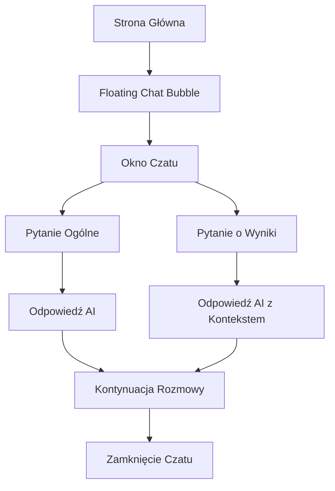

# Dokument Wymagań Produktowych - Czatbot AI ZUS na Plus

## 1. Przegląd Produktu

Czatbot AI to inteligentny asystent wbudowany w aplikację "ZUS na Plus", który pomaga użytkownikom w zrozumieniu systemu emerytalnego w Polsce oraz interpretacji wyników z symulatora emerytalnego. Czatbot wykorzystuje technologię Google Gemini AI do udzielania precyzyjnych odpowiedzi na pytania dotyczące ZUS-u, składek emerytalnych i prognoz emerytalnych.

Głównym celem czatbota jest zwiększenie dostępności i zrozumiałości skomplikowanych zagadnień emerytalnych dla przeciętnego użytkownika, jednocześnie wspierając proces edukacyjny w zakresie planowania emerytalnego.

## 2. Funkcje Podstawowe

### 2.1 Role Użytkowników

| Rola | Metoda Dostępu | Podstawowe Uprawnienia |
|------|----------------|------------------------|
| Użytkownik Anonimowy | Bezpośredni dostęp | Może zadawać pytania ogólne o ZUS i emerytury |
| Użytkownik z Symulacją | Po wykonaniu kalkulacji | Może zadawać pytania o swoje wyniki + pytania ogólne |

### 2.2 Moduł Funkcjonalny

Aplikacja czatbota składa się z następujących głównych stron/komponentów:

1. **Floating Chat Bubble**: minimalistyczna ikona czatu w prawym dolnym rogu
2. **Okno Czatu**: rozwijane okno konwersacji z AI
3. **Panel Kontekstu**: integracja z wynikami symulacji użytkownika

### 2.3 Szczegóły Stron

| Nazwa Strony | Nazwa Modułu | Opis Funkcjonalności |
|--------------|--------------|---------------------|
| Floating Chat Bubble | Ikona Czatu | Wyświetla ikonę czatu z licznikiem nieprzeczytanych wiadomości, animacje hover, pozycjonowanie fixed |
| Okno Czatu | Interface Konwersacji | Wyświetla historię rozmowy, pole wprowadzania tekstu, przyciski szybkich pytań, scroll do najnowszych wiadomości |
| Panel Kontekstu | Integracja Danych | Automatycznie przekazuje kontekst symulacji do AI, wyświetla sugestie pytań na podstawie wyników |

## 3. Główny Proces

**Przepływ Użytkownika Anonimowego:**
1. Użytkownik wchodzi na stronę aplikacji
2. Widzi floating bubble w prawym dolnym rogu
3. Klika na bubble - otwiera się okno czatu
4. Zadaje pytanie ogólne o ZUS/emerytury
5. Otrzymuje odpowiedź od AI
6. Może kontynuować konwersację lub zamknąć czat

**Przepływ Użytkownika z Symulacją:**
1. Użytkownik wykonuje kalkulację emerytalną
2. Przechodzi do wyników
3. Czatbot automatycznie oferuje pomoc w interpretacji wyników
4. Użytkownik może zadać pytania specyficzne dla swoich wyników
5. AI odpowiada z uwzględnieniem kontekstu symulacji

## 4. Projekt Interfejsu Użytkownika

### 4.1 Styl Projektowy

- **Kolory główne**: #3B82F6 (niebieski), #1E293B (ciemny szary)
- **Kolory pomocnicze**: #F8FAFC (jasny szary), #10B981 (zielony dla pozytywnych akcji)
- **Styl przycisków**: Zaokrąglone (rounded-xl), z efektami hover i focus
- **Czcionka**: Inter, rozmiary 14px-16px dla tekstu, 12px dla pomocniczych informacji
- **Styl układu**: Floating design z cieniami, animacje smooth transition
- **Ikony**: Lucide React icons, styl minimalistyczny

### 4.2 Przegląd Projektowy Stron

| Nazwa Strony | Nazwa Modułu | Elementy UI |
|--------------|--------------|-------------|
| Floating Chat Bubble | Ikona Czatu | Okrągły przycisk 60x60px, kolor #3B82F6, ikona MessageCircle, cień drop-shadow-lg, animacja bounce przy hover |
| Okno Czatu | Interface Konwersacji | Białe tło, zaokrąglone rogi 16px, szerokość 380px, wysokość 500px, header z tytułem i przyciskiem zamknij |
| Panel Wiadomości | Lista Konwersacji | Wiadomości użytkownika: prawe wyrównanie, tło #3B82F6, tekst biały; Wiadomości AI: lewe wyrównanie, tło #F1F5F9, tekst #1E293B |

### 4.3 Responsywność

Aplikacja jest mobile-first z adaptacją na desktop. Na urządzeniach mobilnych czat zajmuje pełną szerokość ekranu z marginesami 16px. Zoptymalizowana pod kątem interakcji dotykowych z większymi obszarami klikalnymi.

## 5. Wymagania Techniczne

### 5.1 Integracja AI

- **Model**: Google Gemini Pro
- **Kontekst**: Specjalizacja w tematyce ZUS, emerytury, system emerytalny Polski
- **Ograniczenia**: Maksymalnie 4000 tokenów na odpowiedź
- **Bezpieczeństwo**: Klucz API przechowywany w zmiennych środowiskowych

### 5.2 Funkcjonalności Specjalne

- **Pamięć Kontekstu**: Zachowywanie historii rozmowy w sesji
- **Szybkie Pytania**: Predefiniowane przyciski z popularnymi pytaniami
- **Integracja z Wynikami**: Automatyczne przekazywanie danych symulacji do kontekstu AI
- **Typing Indicator**: Animacja podczas generowania odpowiedzi

### 5.3 Przykładowe Pytania

**Kategoria Ogólna:**
- "Jak działa system emerytalny w Polsce?"
- "Kiedy mogę przejść na emeryturę?"
- "Jak obliczane są składki ZUS?"

**Kategoria Kontekstowa (po symulacji):**
- "Dlaczego moja emerytura jest tak niska?"
- "Jak mogę zwiększyć wysokość emerytury?"
- "Co oznacza stopa zastąpienia w moich wynikach?"