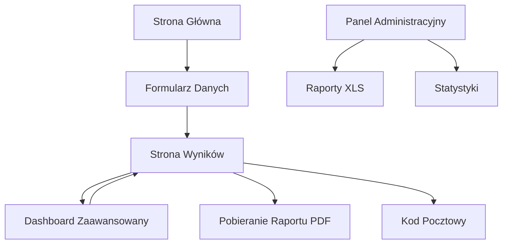

# Dokument Wymagań Produktowych - ZUS na Plus ()

## 1. Product Overview

ZUS na Plus to zaawansowane narzędzie edukacyjne do prognozowania wysokości emerytury, wykorzystujące moduły aktuarialne FUS20. Aplikacja umożliwia użytkownikom precyzyjne oszacowanie przyszłych świadczeń emerytalnych na podstawie danych historycznych i prognoz demograficzno-ekonomicznych do 2080 roku.

Produkt rozwiązuje problem braku dostępu do profesjonalnych narzędzi prognostycznych dla obywateli, oferując transparentne i naukowe podejście do planowania emerytalnego. Docelowymi użytkownikami są wszyscy ubezpieczeni w systemie ZUS oraz doradcy finansowi.

## 2. Core Features

### 2.1 User Roles

| Role | Registration Method | Core Permissions |
|------|---------------------|------------------|
| Użytkownik Podstawowy | Brak rejestracji - dostęp anonimowy | Może korzystać z podstawowych funkcji symulatora, wprowadzać dane osobowe, generować prognozy |
| Administrator ZUS | Logowanie służbowe | Pełny dostęp do raportów administracyjnych, statystyk użycia, zarządzania parametrami systemu |

### 2.2 Feature Module

Nasz symulator składa się z następujących głównych stron:

1. **Pulpit Podstawowy (1.1)**: wprowadzenie oczekiwanej emerytury, kontekstualizacja względem średnich, wykresy grup emerytalnych z tooltipami, losowe ciekawostki
2. **Symulacja Emerytury (1.2)**: formularz danych z walidacją, oszacowanie środków ZUS, kalkulacja kapitału początkowego, waloryzacja wynagrodzeń, opcja zwolnień lekarskich
3. **Strona wyników (1.3)**: prezentacja prognozy emerytury, analiza chorobowa, prognoza odroczenia, kontekstualizacja powiatowa
4. **Dashboard zaawansowany (1.4)**: kontrola założeń aktuarialnych, modyfikacja parametrów FUS20, symulacja wariantowa
5. **Panel administracyjny (1.5-1.7)**: raportowanie użycia, statystyki, zarządzanie danymi, pobieranie raportów XLS

### 2.3 Page Details

| Page Name | Module Name | Feature description |
|-----------|-------------|---------------------|
| Pulpit Podstawowy | Wprowadzenie oczekiwanej emerytury | Pytanie o kwotę oczekiwanej emerytury z natychmiastową kontekstualizacją względem obecnej średniej wysokości świadczenia |
| Pulpit Podstawowy | Wizualizacja grup emerytalnych | Wykres ze średnią wysokością świadczenia dla różnych grup z tooltipami zawierającymi krótką charakterystykę (emerytury poniżej minimalnej, brak 25/20 lat pracy) |
| Pulpit Podstawowy | Ciekawostki emerytalne | Wyświetla losowe ciekawostki o najwyższej emeryturze w Polsce, długości stażu pracy, braku zwolnień lekarskich |
| Symulacja Emerytury | Dane obowiązkowe | Zbiera wiek, płeć, wysokość wynagrodzenia brutto, rok rozpoczęcia i zakończenia pracy (domyślnie wiek emerytalny) |
| Symulacja Emerytury | Dane fakultatywne | Umożliwia wprowadzenie zgromadzonych środków na koncie i subkoncie ZUS, stażu składkowego/nieskładkowego na 31.12.1998 |
| Symulacja Emerytury | Oszacowanie środków ZUS | Automatyczne oszacowanie wysokości środków na koncie/subkoncie jeśli pole fakultatywne nie zostało wypełnione |
| Symulacja Emerytury | Kalkulacja Kapitału Początkowego | Obliczenie CP na podstawie stażu 1-20 lat na 31.12.1998 z wykorzystaniem tabel referencyjnych (20 lat: Kobiety 99,937 zł, Mężczyźni 111,358 zł) |
| Symulacja Emerytury | Waloryzacja wynagrodzeń | Odwrócenie indeksacji wynagrodzeń o średni wzrost w Polsce (NBP/GUS) od rozpoczęcia pracy, zastosowanie historycznych wskaźników waloryzacji składek |
| Symulacja Emerytury | Opcja zwolnień lekarskich | Uwzględnienie średniej długości absencji chorobowej dla danej płci i wieku (60 lat: Mężczyźni 37.19 dni, Kobiety 47.47 dni) |
| Symulacja Emerytury | Informacja o zwolnieniach | Wyświetlanie informacji o wpływie średnich zwolnień w Polsce na obniżenie świadczenia |
| Symulacja Emerytury | Walidacja dat | Zapewnia że daty pracy odnoszą się do stycznia, ustawia domyślny rok zakończenia na wiek emerytalny |
| Strona wyników | Prognoza emerytury | Oblicza i wyświetla prognozowaną wysokość emerytury z wykorzystaniem FUS20 w wartościach rzeczywistych i urealnionych |
| Strona wyników | Stopa zastąpienia | Porównuje wynagrodzenie zindeksowane do prognozowanego świadczenia |
| Strona wyników | Analiza chorobowa | Prezentuje wysokość świadczenia bez i z uwzględnieniem okresów chorobowych |
| Strona wyników | Prognoza odroczenia | Pokazuje wzrost świadczenia przy odłożeniu emerytury o 1, 2, 5 lat z analizą statystyczną opóźnień |
| Strona wyników | Gap analysis | Informuje o ile dłużej trzeba pracować aby osiągnąć oczekiwaną kwotę |
| Strona wyników | Kontekst powiatowy | Porównuje prognozę ze statystykami z danego powiatu (najwyższa, najniższa, przeciętna emerytura) |
| Strona wyników | Kontekst zawodowy | Prezentuje przeciętne emerytury dla różnych kodów tytułu ubezpieczenia (Pracownicy, Zleceniobiorcy, Posłowie/Senatorowie) |
| Strona wyników | Pobieranie raportu | Umożliwia pobranie raportu PDF z prognozą, wykresami i parametrami |
| Strona wyników | Kod pocztowy | Opcjonalne pole do wprowadzenia kodu pocztowego dla celów statystycznych |
| Dashboard zaawansowany | Wybór wariantu FUS20 | Umożliwia przełączanie między Wariantem 1 (pośredni), 2 (pesymistyczny), 3 (optymistyczny) |
| Dashboard zaawansowany | Parametry makroekonomiczne | Pozwala modyfikować stopę bezrobocia, wzrost wynagrodzeń, inflację, ściągalność składek |
| Dashboard zaawansowany | Okresy chorobowe | Wprowadzanie okresów choroby z uwzględnieniem danych powiatowych |
| Dashboard zaawansowany | Podgląd środków | Wizualizuje wzrost kwoty na koncie i subkoncie ZUS w czasie |
| Dashboard zaawansowany | Kapitał początkowy | Umożliwia wprowadzenie lub wyliczenie kapitału początkowego na podstawie stażu |
| Panel administracyjny | Raportowanie użycia | Generuje raporty XLS z danymi użycia: data, godzina, parametry, wyniki |
| Panel administracyjny | Struktura raportu | Raport zawiera nagłówki: Data użycia, Godzina użycia, Emerytura oczekiwana, Wiek, Płeć, Wysokość wynagrodzenia, Czy uwzględniał okresy choroby, Wysokość zgromadzonych środków na koncie i Subkoncie, Emerytura rzeczywista, Emerytura urealniona, Kod pocztowy |
| Panel administracyjny | Statystyki | Prezentuje statystyki użycia symulatora, najpopularniejsze scenariusze |

## 3. Core Process

**Główny przepływ użytkownika:**
1. Użytkownik wchodzi na stronę główną i zapoznaje się z wprowadzeniem
2. Wprowadza oczekiwaną wysokość emerytury (kontekstualizowana względem średnich)
3. Wypełnia formularz z danymi osobowymi i zawodowymi
4. System wykonuje kalkulacje wykorzystując FUS20, wskaźniki waloryzacji i tablice życia
5. Użytkownik otrzymuje szczegółową prognozę z analizami i kontekstem
6. Opcjonalnie podaje kod pocztowy dla celów statystycznych
7. Może pobrać raport PDF z wynikami
8. Opcjonalnie przechodzi do dashboardu zaawansowanego dla symulacji wariantowych

**Przepływ administratora:**
1. Logowanie do panelu administracyjnego
2. Przeglądanie raportów użycia i statystyk
3. Pobieranie raportów XLS z danymi użytkowników
4. Zarządzanie parametrami systemu i danymi referencyjnymi

## 4. User Interface Design

### 4.1 Design Style

- **Kolory podstawowe**: 
  - Pomarańczowy ZUS: RGB(255, 179, 79)
  - Zielony ZUS: RGB(0, 153, 63)
  - Niebieski ZUS: RGB(63, 132, 210)
- **Kolory pomocnicze**:
  - Szary: RGB(190, 195, 206)
  - Granatowy: RGB(0, 65, 110)
  - Czerwony: RGB(240, 94, 94)
  - Czarny: RGB(0, 0, 0)
- **Styl przycisków**: Zaokrąglone przyciski z subtelnymi cieniami, zgodne z identyfikacją ZUS
- **Czcionka**: System font stack z preferencją dla czytelnych fontów bezszeryfowych, rozmiary 14-16px dla tekstu podstawowego
- **Layout**: Responsywny design z nawigacją górną, układ kartowy dla sekcji danych
- **Ikony**: Minimalistyczne ikony w stylu outline, zgodne z wytycznymi dostępności

### 4.2 Page Design Overview

| Page Name | Module Name | UI Elements |
|-----------|-------------|-------------|
| Pulpit Podstawowy | Wprowadzenie oczekiwanej emerytury | Duży nagłówek z gradientem ZUS, centralne pole wprowadzania kwoty z walidacją, natychmiastowe porównanie do średniej emerytury |
| Pulpit Podstawowy | Wizualizacja grup emerytalnych | Interaktywny wykres słupkowy z tooltipami zawierającymi charakterystyki grup, kolory zgodne z paletą ZUS, animacje hover |
| Pulpit Podstawowy | Ciekawostki emerytalne | Rotujące karty z losowymi faktami, ikony ilustrujące treść, subtelne animacje przejść |
| Symulacja Emerytury | Pola obowiązkowe | Czytelne etykiety, walidacja w czasie rzeczywistym, progress bar, responsywny grid layout z sekcjami |
| Symulacja Emerytury | Pola fakultatywne | Opcjonalne sekcje z możliwością rozwinięcia, tooltips z wyjaśnieniami, automatyczne oszacowanie środków |
| Symulacja Emerytury | Opcja zwolnień | Toggle switch z informacją o wpływie na świadczenie, wizualizacja różnicy w wynikach |
| Symulacja Emerytury | Walidacja dat | Automatyczne ustawianie stycznia jako miesiąca, kalkulatory wieku emerytalnego, podpowiedzi |
| Strona wyników | Prognoza | Duże liczby z wyróżnieniem, wykresy liniowe pokazujące progresję, karty z kluczowymi wskaźnikami |
| Strona wyników | Pobieranie raportu | Przycisk pobierania PDF z ikoną dokumentu, opcjonalne pole kodu pocztowego z walidacją |
| Dashboard zaawansowany | Kontrolki | Suwaki dla parametrów, toggle switches dla wariantów, wykresy reagujące na zmiany w czasie rzeczywistym |
| Panel administracyjny | Tabele danych | Sortowalne tabele z filtrowaniem, eksport do XLS, wykresy dashboardowe, paginacja |
| Panel administracyjny | Raporty | Interfejs generowania raportów z filtrowaniem dat, eksport XLS z progress barem |

### 4.3 Responsiveness

Aplikacja jest projektowana mobile-first z pełną adaptacją na urządzenia dotykowe. Priorytet dla dostępności WCAG 2.0 z obsługą czytników ekranu, nawigacją klawiaturową i wysokim kontrastem kolorów. Optymalizacja dla tabletów i desktopów z rozszerzonymi funkcjami wizualizacji.

## 5. Kluczowe Dane FUS20 - Wariant 1 (Pośredni)

### 5.1 Źródło i Zakres
- **Źródło**: Prognoza Ministerstwa Finansów z 2022 r.
- **Wariant**: Pośredni (nr 1)
- **Lata prognozy**: 2023-2080

### 5.2 Dane Makroekonomiczne

| Rok | Stopa Bezrobocia | Realny Wzrost Wynagrodzenia | Ściągalność Składek |
|-----|------------------|----------------------------|---------------------|
| 2023 | 5,40% | 100,30% | 99,00% |
| 2025 | 5,00% | 103,70% | 99,00% |
| 2040 | 5,00% | 102,70% | 99,00% |
| 2080 | 5,00% | 102,00% | 99,00% |

### 5.3 Wyniki Prognostyczne (mln PLN, zdyskontowane na 2021 r.)

| Rok | Saldo Roczne | Wpływy | Wydatki |
|-----|--------------|--------|----------|
| 2023 | -59 575 | 145 016 | 204 591 |
| 2030 | -93 104 | 177 027 | 270 131 |
| 2052 (Max Deficit) | Największa wartość deficytu: 93,1 mld zł | - | - |
| 2080 | -52 121 | 372 457 | 424 578 |

### 5.4 Wydolność i Obciążenie

| Rok | Wydolność | Współczynnik Obciążenia |
|-----|-----------|------------------------|
| 2023 | 71% | 0,40 |
| 2060 | 78% | 0,81 |
| 2080 | 88% (wzrost o 16,8 p.p. od 2023 r.) | 0,84 |